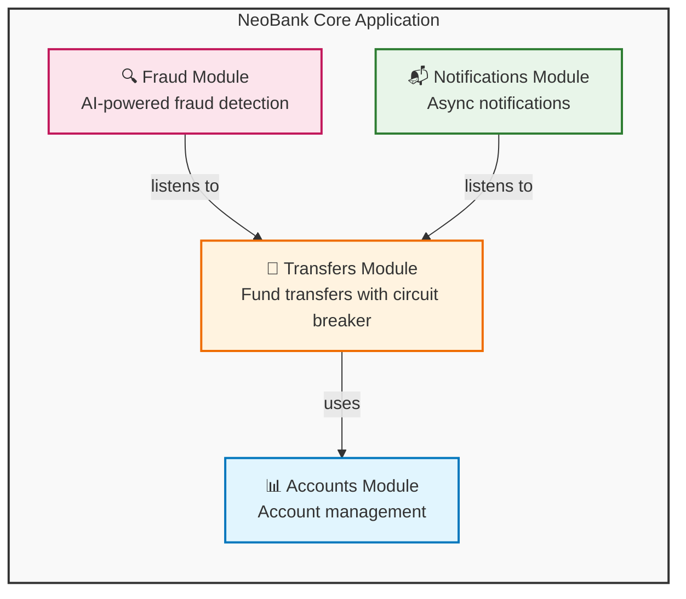

# NeoBank Core


A next-generation banking platform built with cutting-edge Java technologies and modular architecture. Features AI-powered fraud detection, resilient event-driven design, and strict architectural boundaries.

---

## Prerequisites

Before running NeoBank Core, ensure you have the following installed:

| Requirement | Version | Purpose |
|-------------|---------|---------|
| **Java** | 25+ | Runtime environment (virtual threads support) |
| **Maven** | 3.9+ | Build and dependency management |
| **Docker** | 24+ | Containerization for PostgreSQL and Ollama |

---

## High-Level Architecture



### Architecture Overview

| Module | Responsibility | Key Features |
|--------|---------------|--------------|
| **Accounts** | Account creation, retrieval, and balance management | Pessimistic locking, JSONB transaction history |
| **Transfers** | Atomic fund transfers with circuit breaker protection | Resilience4j, event publishing, async processing |
| **Fraud** | AI-powered fraud analysis | Hybrid AI (OpenAI/Ollama), risk scoring, Micrometer tracking |
| **Notifications** | Asynchronous event listener | Transaction notifications, non-blocking |

All modules communicate through **Spring Modulith's** enforced boundaries, ensuring loose coupling and architectural integrity.

---

## Tech Stack

| Technology | Version | Purpose |
|------------|---------|---------|
| Java | 25 | Virtual threads, records, pattern matching |
| Spring Boot | 4.0.0 | Application framework |
| Spring Modulith | 1.4.0 | Modular architecture enforcement |
| Spring AI | 2.0.0-M1 | Hybrid AI (OpenAI/Ollama) for fraud detection |
| Resilience4j | 2.3.0 | Circuit breaker pattern for fault tolerance |
| Spring Data JPA | - | Database access layer |
| PostgreSQL | 17 | Production database |
| Testcontainers | 2.0.3 | Integration testing with real PostgreSQL |
| Micrometer | - | Metrics and observability (Prometheus) |
| OpenAPI/Swagger | 2.8.9 | API documentation |
| Ollama | latest | Local AI model runner (llama3.2) |

---

## Key Features

### Java 25
- **Virtual Threads** (Project Loom) - High-throughput concurrency
- **Records** - Immutable data carriers with concise syntax
- **Pattern Matching** - Enhanced type checking and data extraction

### Spring Modulith
- Module isolation and dependency validation
- Automated architecture documentation generation
- Prevents architectural drift through verification tests
- **Persistent Event Registry** - Events stored until successfully processed

### Spring AI
- Hybrid AI support (OpenAI cloud / Ollama local)
- Automatic token usage tracking via Micrometer
- Configurable risk thresholds with priority alerts

### Resilience4j Circuit Breakers
- Automatic circuit breaking when failure rates exceed 50%
- Graceful degradation with fallback responses
- Self-healing after configurable recovery periods

### PostgreSQL with Testcontainers
- Real PostgreSQL instances in Docker for integration tests
- No local database setup required
- Consistent, reproducible test environments

---

## Resilience Features

### Event Registry (Spring Modulith)
Domain events persisted to `event_publication` table:

| Feature | Benefit |
|---------|---------|
| **Durability** | Events survive application restarts |
| **Reliability** | Failed listeners automatically retried |
| **Consistency** | Events published after transaction commit |

```properties
spring.modulith.events.republish-outstanding-events-on-restart=true
spring.modulith.events.replication.period=60
```

### Circuit Breaker (Resilience4j)

| Setting | Value | Description |
|---------|-------|-------------|
| `failure-rate-threshold` | 50% | Opens when 50% calls fail |
| `wait-duration-in-open-state` | 30s | Time before half-open |
| `minimum-number-of-calls` | 5 | Min calls before evaluation |
| `sliding-window-size` | 10 | Call window for calculation |

```properties
resilience4j.circuitbreaker.instances.transfer.failure-rate-threshold=50
resilience4j.circuitbreaker.instances.transfer.wait-duration-in-open-state=30s
resilience4j.circuitbreaker.instances.transfer.minimum-number-of-calls=5
```

### AI Fraud Detection

| Feature | Description |
|---------|-------------|
| **Async Processing** | Non-blocking analysis via `@Async` |
| **Risk Scoring** | 0-100 score per transaction |
| **Alert Threshold** | `[FRAUD ALERT]` logged for scores > 80 |
| **Observability** | Token usage tracked via `gen_ai.client.token.usage` |

---

## Hybrid AI Strategy (Local vs. Cloud)

NeoBank supports multiple AI providers through Spring AI's abstraction layer.

### Supported Providers

| Provider | Model | Use Case | Cost | Latency |
|----------|-------|----------|------|---------|
| **OpenAI** | gpt-4o-mini | Production, highest accuracy | Pay-per-token | ~500ms |
| **Ollama** | llama3.2 | Local development, offline | Free | ~100ms |

---

## Switching AI Providers: Complete Guide

### Quick Start

```bash
# Development (Local/Ollama) - Default
./mvnw spring-boot:run

# Production (Cloud/OpenAI)
export OPENAI_API_KEY=sk-...
./mvnw spring-boot:run -Dspring-boot.run.profiles=openai
```

### Method 1: Maven Command Line (Recommended for Development)

```bash
# Run with Ollama (Local AI)
./mvnw spring-boot:run -Dspring-boot.run.profiles=local

# Run with OpenAI (Cloud AI)
export OPENAI_API_KEY=your-api-key-here
./mvnw spring-boot:run -Dspring-boot.run.profiles=openai
```

### Method 2: Java JAR Command (Production Deployment)

```bash
# Run with Ollama (Local AI)
java -jar target/neobank-core-0.0.1-SNAPSHOT.jar \
    --spring.profiles.active=local

# Run with OpenAI (Cloud AI)
java -jar target/neobank-core-0.0.1-SNAPSHOT.jar \
    --spring.profiles.active=openai \
    --spring.ai.openai.api-key=your-api-key-here
```

### Method 3: Environment Variable

```bash
# Set profile via environment
export SPRING_PROFILES_ACTIVE=local
./mvnw spring-boot:run

# Or for OpenAI
export SPRING_PROFILES_ACTIVE=openai
export OPENAI_API_KEY=your-api-key-here
./mvnw spring-boot:run
```

### Method 4: Permanent Configuration Change

Edit `src/main/resources/application.properties`:

```properties
# Change this line to switch default provider
spring.profiles.active=local    # or 'openai' for cloud-first
```

### Method 5: Docker Compose Profiles

```bash
# Local Development (includes Ollama container)
docker-compose --profile local up -d

# Production with OpenAI
export OPENAI_API_KEY=your-api-key-here
docker-compose --profile openai up -d
```

**What each profile starts:**

| Profile | Containers | Ports | Best For |
|---------|-----------|-------|----------|
| `local` | PostgreSQL, Ollama, NeoBank | 5432, 11434, 8080 | Development, testing |
| `openai` | PostgreSQL, NeoBank | 5432, 8081 | Production, CI/CD |

### Verification

```bash
# Check application info endpoint
curl http://localhost:8080/actuator/info | jq .

# Check logs for provider initialization
docker logs neobank-core | grep -i "ollama\|openai"
```

**Expected log output for local profile:**
```
Using Ollama Chat API at http://localhost:11434
Model: llama3.2
```

**Expected log output for openai profile:**
```
Using OpenAI Chat API
Model: gpt-4o-mini
```

### Fraud Detection Test

```bash
# Create accounts
curl -X POST http://localhost:8080/api/accounts \
    -H "Content-Type: application/json" \
    -d '{"ownerName": "Alice", "balance": 1000}'

curl -X POST http://localhost:8080/api/accounts \
    -H "Content-Type: application/json" \
    -d '{"ownerName": "Bob", "balance": 500}'

# Transfer and watch fraud analysis
curl -X POST http://localhost:8080/api/transfers \
    -H "Content-Type: application/json" \
    -d '{"fromId": "<alice-id>", "toId": "<bob-id>", "amount": 100}'

# Check fraud logs
docker logs neobank-core | grep -i "fraud\|risk"
```

### Troubleshooting

**Ollama not responding:**
```bash
# Pull model manually
docker exec -it neobank-ollama ollama pull llama3.2

# Verify Ollama is running
curl http://localhost:11434/api/tags
```

**OpenAI API errors:**
```bash
# Verify API key is set
echo $OPENAI_API_KEY

# Test OpenAI connectivity
curl https://api.openai.com/v1/models \
    -H "Authorization: Bearer $OPENAI_API_KEY"
```

### Cost Considerations

| Aspect | Local (Ollama) | Cloud (OpenAI) |
|--------|----------------|----------------|
| **Setup Cost** | None (uses local GPU/CPU) | API key required |
| **Per-Request Cost** | $0 | ~$0.0001-0.001 per transfer |
| **Hardware** | 8GB RAM minimum | None |
| **Accuracy** | Good for standard patterns | Higher for edge cases |
| **Privacy** | All data stays local | Data sent to OpenAI |

> **Recommendation:** Use **local** for development and testing. Switch to **openai** for production where higher accuracy justifies the cost.

---

## Getting Started

### Environment Variables

```bash
# Required for OpenAI/cloud mode
export OPENAI_API_KEY=your-api-key-here

# PostgreSQL configuration (optional, has defaults)
export POSTGRES_USER=postgres
export POSTGRES_PASSWORD=postgres
export POSTGRES_URL=jdbc:postgresql://localhost:5432/neobank
```

### Build and Test

```bash
./mvnw clean test
```

### Fraud Detection Tests: AI Provider Configuration

Tests can run with either **Ollama (local)** or **OpenAI (cloud)**.

#### Default: Test with Ollama (Docker)

```bash
# Start Ollama in Docker (required for local testing)
docker-compose --profile test up -d ollama

# Wait for Ollama to be ready (pulls llama3.2 on first run)
docker logs neobank-ollama -f

# Run tests with Ollama (default)
FRAUD_TEST_USE_OPENAI=false ./mvnw clean test
```

#### Alternative: Test with OpenAI API

```bash
# Run tests with OpenAI (requires valid API key)
export OPENAI_API_KEY=sk-...
FRAUD_TEST_USE_OPENAI=true ./mvnw clean test
```

#### Test Configuration Properties

| Property | Default | Description |
|----------|---------|-------------|
| `FRAUD_TEST_USE_OPENAI` | `false` | Set to `true` to use OpenAI for tests |
| `OLLAMA_BASE_URL` | `http://localhost:11434` | Ollama endpoint for local tests |
| `OPENAI_API_KEY` | `test-key` | Required when `FRAUD_TEST_USE_OPENAI=true` |

#### Test Behavior

| Mode | Configuration | Connection | Model | Cost |
|------|---------------|------------|-------|------|
| **Ollama** | `FRAUD_TEST_USE_OPENAI=false` | `http://localhost:11434` | llama3.2 | Free |
| **OpenAI** | `FRAUD_TEST_USE_OPENAI=true` | OpenAI API | gpt-4o-mini | API costs |

#### Troubleshooting Test Failures

**Connection refused to Ollama:**
```bash
# Ensure Ollama container is running
docker-compose --profile test up -d ollama

# Verify Ollama is accessible
curl http://localhost:11434/api/tags

# Check Ollama has the model
docker exec neobank-ollama ollama run llama3.2 'hello'
```

**OpenAI API errors in tests:**
```bash
# Verify API key is valid
export OPENAI_API_KEY=sk-...
curl https://api.openai.com/v1/models -H "Authorization: Bearer $OPENAI_API_KEY"

# Re-run tests
FRAUD_TEST_USE_OPENAI=true ./mvnw clean test
```

### Run with Docker Compose

```bash
# Local development (Ollama + NeoBank on port 8080)
docker-compose --profile local up -d

# Production (OpenAI + NeoBank on port 8081)
export OPENAI_API_KEY=your-api-key
docker-compose --profile openai up -d
```

### Services

| Profile | Services | Ports |
|---------|----------|-------|
| **local** | PostgreSQL, Ollama, NeoBank Core | 5432, 11434, 8080 |
| **openai** | PostgreSQL, NeoBank Core | 5432, 8081 |

### Health Checks

| Service | Check |
|---------|-------|
| **PostgreSQL** | `pg_isready -U postgres` |
| **Ollama** | Verifies model pull and availability |
| **NeoBank Core** | `GET /actuator/health` |

### Run the Application (Local)

```bash
./mvnw spring-boot:run
```

### API Documentation

OpenAPI documentation is auto-generated via springdoc-openapi:

| Endpoint | URL |
|----------|-----|
| **Swagger UI** | `http://localhost:8080/swagger-ui.html` |
| **OpenAPI JSON** | `http://localhost:8080/v3/api-docs` |

### Architecture Documentation

C4/PlantUML diagrams are generated via Spring Modulith's `Documenter`:

```bash
./mvnw test -Dtest=ArchitectureDocumentationTest
```

Generated docs are output to `target/modulith-docs/`.

---

## Project Structure

```
com.neobank
├── NeoBankCoreApplication.java
├── accounts/
│   ├── Account.java (Record)
│   ├── AccountEntity.java
│   ├── AccountRepository.java
│   ├── AccountService.java
│   └── api/AccountApi.java
├── transfers/
│   ├── TransferRequest.java (Record)
│   ├── TransactionResult.java (Record)
│   ├── TransferCompletedEvent.java (Record)
│   ├── api/TransferApi.java
│   ├── internal/ (package-private implementation)
│   └── web/TransferController.java
├── notifications/
│   └── NotificationService.java
└── fraud/
    ├── FraudListener.java
    └── FraudAnalysisConfig.java
```

---

## Module Boundaries

Spring Modulith enforces that modules only communicate through their public APIs:

| Module | Responsibility |
|--------|---------------|
| **accounts** | Account creation, retrieval, and management |
| **transfers** | Fund transfers with atomic transactions and event publishing |
| **notifications** | Asynchronous event listeners for side effects |
| **fraud** | AI-powered fraud analysis (listens to transfers) |

---

## Observability

### Metrics

Micrometer with Prometheus registry tracks:

| Metric | Description |
|--------|-------------|
| Transfer rate | Transfers per second |
| Circuit breaker state | State transitions |
| Event publication | Success/failure rates |
| AI token usage | `gen_ai.client.token.usage` |

Access metrics at: `http://localhost:8080/actuator/prometheus`

### Tracing

- Micrometer tracing enabled for all AI operations
- Token counts tracked per transaction
- Configurable observation include/exclude settings

---

## Contributing

1. Fork the repository
2. Create a feature branch
3. Make your changes
4. Run tests: `./mvnw clean test`
5. Submit a pull request

For detailed contribution guidelines, see [CONTRIBUTING.md](CONTRIBUTING.md).

---

## Roadmap

We have exciting plans for NeoBank Core! Here's what's coming:

### Phase 1: Core Banking Features

- [ ] **Loans Module**: Implementing interest calculation with Scoped Value API (Java 25)
  - Loan origination workflow
  - Amortization schedules
  - Early repayment handling
  - Risk-based interest rates

### Phase 1.5: Card Services

- [ ] **Card Module**: Lifecycle and spending management
  - Virtual & physical card issuance (linked to Accounts)
  - Status management (Active, Frozen, Blocked, Reported Stolen)
  - Spending controls (per-transaction and monthly limits)
  - MCC (Merchant Category Code) filtering (block gambling, international, etc.)
  - Card PIN management and secure storage
  - Contactless payment limits

### Phase 2: Security & Authentication

- [ ] **Auth Module**: JWT-based security using Spring Security 7
  - User registration and login
  - Role-based access control (RBAC)
  - OAuth2 provider integration
  - Session management with Redis

### Phase 3: User Experience

- [ ] **Frontend**: A lightweight React/Next.js dashboard
  - Account overview and analytics
  - Transfer history with filters
  - Real-time notifications
  - Fraud alert dashboard

### Phase 4: Advanced Features

- [ ] **Multi-currency Support**: FX conversion and international transfers
- [ ] **Scheduled Transfers**: Recurring payments and standing orders
- [ ] **Budgeting Tools**: Spending categorization and limits
- [ ] **Open Banking**: PSD2-compliant API for third-party integrations

### Phase 5: Infrastructure

- [ ] **Kubernetes Deployment**: Helm charts for cloud-native deployment
- [ ] **Event Sourcing**: Full audit trail with event replay capability
- [ ] **GraphQL API**: Alternative query layer for flexible data fetching
- [ ] **gRPC Services**: High-performance inter-service communication

---

Have ideas or want to contribute to these features? Check out [CONTRIBUTING.md](CONTRIBUTING.md) and join us!

---

## License

This project is licensed under the MIT License - see the [LICENSE](LICENSE) file for details.

```
MIT License

Copyright (c) 2026 NeoBank Core

Permission is hereby granted, free of charge, to any person obtaining a copy
of this software and associated documentation files (the "Software"), to deal
in the Software without restriction, including without limitation the rights
to use, copy, modify, merge, publish, distribute, sublicense, and/or sell
copies of the Software, and to permit persons to whom the Software is
furnished to do so, subject to the following conditions:

The above copyright notice and this permission notice shall be included in all
copies or substantial portions of the Software.

THE SOFTWARE IS PROVIDED "AS IS", WITHOUT WARRANTY OF ANY KIND, EXPRESS OR
IMPLIED, INCLUDING BUT NOT LIMITED TO THE WARRANTIES OF MERCHANTABILITY,
FITNESS FOR A PARTICULAR PURPOSE AND NONINFRINGEMENT. IN NO EVENT SHALL THE
AUTHORS OR COPYRIGHT HOLDERS BE LIABLE FOR ANY CLAIM, DAMAGES OR OTHER
LIABILITY, WHETHER IN AN ACTION OF CONTRACT, TORT OR OTHERWISE, ARISING FROM,
OUT OF OR IN CONNECTION WITH THE SOFTWARE OR THE USE OR OTHER DEALINGS IN THE
SOFTWARE.
```
