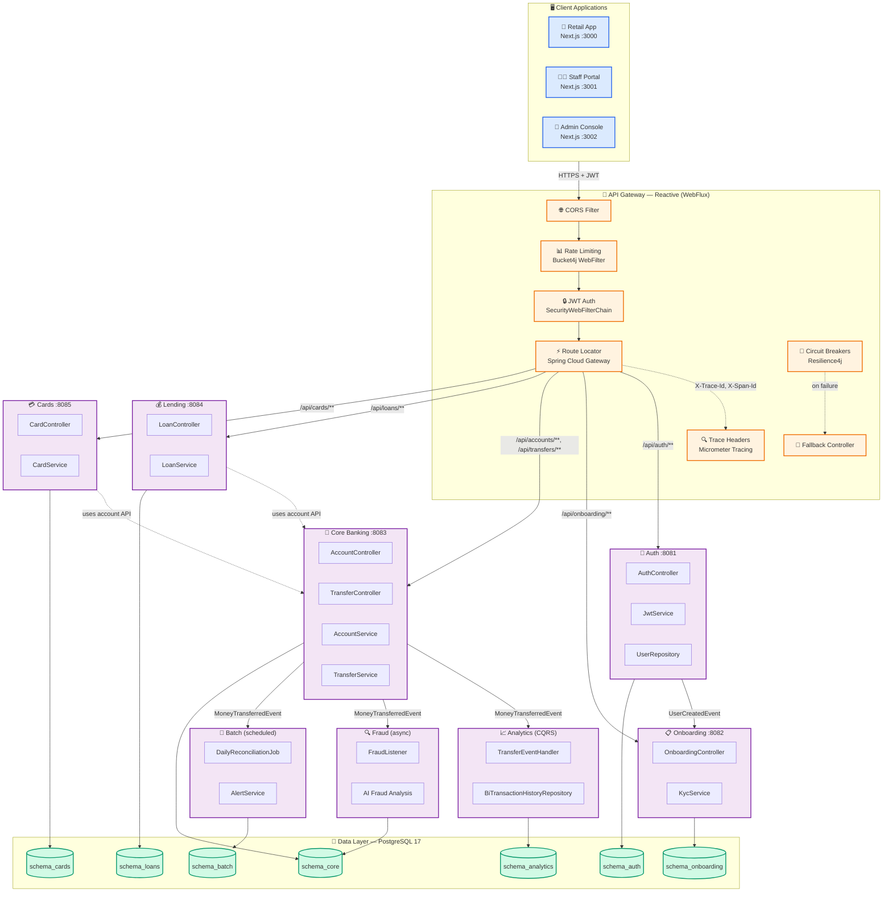

# NeoBank Core - Technical Architecture

This document contains the technical architecture, development roadmap, and implementation details for NeoBank Core.

---

## Table of Contents

- [Development Status](#development-status)
- [High-Level Architecture](#high-level-architecture)
- [Gateway Architecture](#gateway-architecture)
- [Tech Stack](#tech-stack)
- [Key Features](#key-features)
- [Resilience Features](#resilience-features)
- [Hybrid AI Strategy](#hybrid-ai-strategy)
- [Project Structure](#project-structure)
- [Module Boundaries](#module-boundaries)
- [Roadmap](#roadmap)

---

---

## Strategic Decoupling: 9-Module Architecture

NeoBank's architecture follows a **"Strategic Decoupling"** pattern: cross-cutting concerns are centralized in the Gateway while domain-specific business logic lives in independently deployable downstream services.

### Gateway: The Cross-Cutting Layer

The reactive API Gateway (Spring Cloud Gateway + WebFlux) owns all concerns that apply uniformly across services:

| Concern | Implementation | Responsibility |
|---------|---------------|----------------|
| **Authentication** | Spring Security WebFlux + JWT Resource Server | Validates JWT tokens before any route is matched; unauthorized requests never reach downstream services |
| **Rate Limiting** | Reactive Bucket4j WebFilter | Per-user and per-IP token-bucket rate limiting (5–500 req/min); returns 429 before downstream services are called |
| **Circuit Breaking** | Resilience4j per-route circuit breakers | Automatically opens circuits on >50% failure rate, fails fast with 503, and routes to fallback controllers — protecting downstream services from cascading failures |
| **Retry Logic** | Spring Cloud Gateway retry filter | Automatic retry (2 attempts, exponential backoff) on 503 responses for all HTTP methods |
| **Trace Propagation** | Micrometer Tracing filter | Injects `X-Trace-Id`, `X-Span-Id`, `traceparent`, and `b3` headers into every downstream request for end-to-end distributed tracing |
| **CORS & Security Headers** | Reactive SecurityWebFilterChain | Restricts origins to 3 approved frontend domains, enforces HttpOnly/Secure/SameSite=Strict cookies |
| **Routing** | RouteLocator with path-based predicates | Maps `/api/auth/**`, `/api/accounts/**`, `/api/loans/**`, etc. to the correct downstream service via internal DNS |
| **Fallback Responses** | FallbackController | Returns structured JSON fallback responses when circuit breakers are open or downstream services are unavailable |

### Downstream Services: The Business Logic Layer

Each of the 8 business modules owns its domain completely — data schema, business rules, and event publication:

| Service | Domain | Schema | Cross-Cutting Isolation |
|---------|--------|--------|------------------------|
| **Auth** | User credentials, JWT issuance, RBAC | `schema_auth` | Spring Security chain with BCrypt, JJWT |
| **Onboarding** | KYC workflow, customer approval | `schema_onboarding` | Status transitions, approval queue |
| **Core Banking** | Accounts, transfers, Maker-Checker | `schema_core` | Pessimistic locking, idempotency keys |
| **Lending** | Loan origination, AI risk assessment | `schema_loans` | Spring AI (OpenAI/Ollama), amortization |
| **Cards** | Card lifecycle, spending controls | `schema_cards` | AES-256-GCM encryption, MCC filtering |
| **Fraud** | AI fraud detection, risk scoring | `schema_fraud` | Async analysis, hybrid AI |
| **Batch** | EOD reconciliation, scheduled jobs | `schema_batch` | Spring Batch, balance verification |
| **Analytics** | CQRS read model, BI aggregation | `schema_analytics` | Denormalized tables, event listeners |

### How Decoupling Works in Practice

```
                    ┌───────────────────────────────────┐
                    │          API Gateway               │
                    │                                   │
  Request ─────────►│  1. Validate JWT                  │
                    │  2. Check rate limit token        │
                    │  3. Add trace headers             │
                    │  4. Match route                   │
                    │  5. Wrap in circuit breaker       │
                    └───────────────┬───────────────────┘
                                    │
                ┌───────────────────┼───────────────────┐
                │                   │                   │
    ┌───────────▼──────┐ ┌─────────▼──────┐ ┌──────────▼───────┐
    │  Core Banking    │ │   Lending      │ │    Cards         │
    │                  │ │                │ │                  │
    │ • Transfer logic │ │ • AI risk eval │ │ • Card issuance  │
    │ • Pessimistic    │ │ • Amortization │ │ • MCC filtering  │
    │   locking        │ │ • Loan state   │ │ • AES encryption │
    │ • Event publish  │ │ • Credit score │ │ • Spending ctrl  │
    └──────────────────┘ └────────────────┘ └──────────────────┘
```

**Key principle:** The Gateway knows *how* to route, secure, and observe. The downstream services know *what* to do with banking data. Neither knows the internals of the other.

### Inter-Module Communication

Modules communicate through **Spring Modulith's persistent event registry**:

- Events are stored in `event_publication` until successfully processed
- Failed listeners are automatically retried after restart
- Events are published *after* transaction commit (`@TransactionalEventListener`)

This ensures eventual consistency without tight coupling: Core Banking doesn't need to know that Analytics and Fraud exist — it just publishes `MoneyTransferredEvent`.

---

## Development Status

| Phase | Module | Status | Description |
|-------|--------|--------|-------------|
| **Phase 1** | Foundation & Docker | ✅ Complete | Multi-module Maven, Docker profiles, database schema config |
| **Phase 2** | Security & Auth | ✅ Complete | JWT authentication, BCrypt passwords, role-based access control |
| **Phase 3** | Core Banking | ✅ Complete | Schema separation, MoneyTransferredEvent, event-driven communication |
| **Phase 4** | Lending & Cards | ✅ Complete | Dedicated schemas, cross-module account operations, AES-256-GCM encryption |
| **Phase 5** | Batch Processing | ✅ Complete | EOD reconciliation, interest calculation, alert system |
| **Phase 5.5** | Analytics/BI | ✅ Complete | CQRS, read-optimized BI tables, aggregation queries |
| **Phase 6** | Multi-Persona Frontend | ✅ Complete | Three Next.js apps with role-based routing |
| **Phase 7** | Gateway & Security | ✅ Complete | Reactive Spring Cloud Gateway, circuit breakers, rate limiting |
| **Phase 8** | Documentation & Testing | ✅ Complete | Architecture docs, 1,390+ tests across all modules |
| **Phase 9** | Observability | ✅ Complete | Micrometer, OpenTelemetry, Prometheus, Grafana |

---

## High-Level Architecture



### Architecture Overview

| Component | Responsibility | Key Features |
|-----------|---------------|--------------|
| **Spring Cloud Gateway** | Reactive API gateway, routing, resilience | WebFlux, circuit breakers, retry, rate limiting, trace propagation |
| **Auth** | User authentication & authorization | JWT tokens, BCrypt passwords, audience validation, UserCreatedEvent publishing |
| **Onboarding** | KYC workflow & user status | Document verification, approval queue, status transitions |
| **Core Banking** | Account & transfer management | Pessimistic locking, JSONB transaction history, Maker-Checker, idempotency |
| **Lending** | Loan origination & management | Risk profiles, interest calculation, amortization schedules, AI-powered decisions |
| **Cards** | Card lifecycle & spending | AES-256-GCM encryption, MCC filtering, spending controls, secure reveal |
| **Batch** | EOD processing & reconciliation | Scheduled jobs, alert generation, balance verification |
| **Analytics** | BI & CQRS read model | Denormalized tables, aggregation queries (SUM, COUNT, GROUP BY) |
| **Fraud** | AI-powered fraud analysis | Hybrid AI (OpenAI/Ollama), risk scoring, async processing |

All modules communicate through **Spring Modulith's** enforced boundaries, ensuring loose coupling and architectural integrity.

---

## Gateway Architecture

The gateway is a **reactive Spring Cloud Gateway** application that routes requests to downstream servlet-based microservices.

### Key Components

| Component | Type | Description |
|-----------|------|-------------|
| `SecurityConfig` | SecurityWebFilterChain | Reactive JWT authentication, CORS, CSRF, security headers |
| `RouteConfig` | RouteLocator | Service routing with circuit breakers and retry policies |
| `RateLimitingFilter` | WebFilter | Reactive Bucket4j rate limiting per user/IP |
| `TracePropagationFilter` | WebFilter | Micrometer trace header propagation |
| `CookieSecurityConfig` | Component | Reactive cookie management (HttpOnly, Secure, SameSite) |
| `FallbackController` | Controller | Circuit breaker fallback responses |

### Route Configuration

```java
.route("auth-service", r -> r
    .path("/api/auth/**")
    .filters(f -> f
        .addResponseHeader("X-Service-Name", "neobank-auth")
        .retry(retry -> retry.setRetries(2))
    )
    .uri(authUri)
)
.route("core-banking-service", r -> r
    .path("/api/accounts/**", "/api/transfers/**")
    .filters(f -> f
        .circuitBreaker(cb -> cb
            .setName("coreBankingCircuitBreaker")
            .setFallbackUri("forward:/fallback/core-banking")
        )
    )
    .uri(coreBankingUri)
)
```

### Security Flow

```
Request → CORS Check → Rate Limit → JWT Validation → Route → Response
                                    ↓
                            Trace Headers Added
```

---

## Tech Stack

### Gateway

| Technology | Version | Purpose |
|------------|---------|---------|
| Java | 21 | Virtual threads, records, pattern matching |
| Spring Boot | 3.5.13 LTS | Reactive application framework |
| Spring Cloud Gateway | 2025.0.0 | API gateway with reactive routing |
| Spring WebFlux | 6.x | Reactive web framework |
| Spring Security | 6.x | Reactive JWT resource server |
| Bucket4j | 8.6.0 | Reactive rate limiting |
| Resilience4j | 2.4.0 | Circuit breaker for gateway routes |
| Micrometer Tracing | 1.6.1 | Distributed trace propagation |

### Backend Modules

| Technology | Version | Purpose |
|------------|---------|---------|
| Java | 21 | Virtual threads, records, pattern matching |
| Spring Boot | 3.5.13 LTS | Application framework |
| Spring Modulith | 1.3.3 | Modular architecture enforcement |
| Spring AI | 1.0.0-M4 | Hybrid AI (OpenAI/Ollama) for fraud detection |
| Spring Security | 6.x | JWT authentication & authorization |
| Resilience4j | 2.4.0 | Circuit breaker pattern for fault tolerance |
| Spring Data JPA | 3.x | Database access layer |
| Hibernate | 6.x | ORM with Jakarta Persistence |
| JJWT | 0.12.6 | JWT token generation and validation |
| PostgreSQL | 17 | Production database |
| Liquibase | 4.31.1 | Database migration management |
| Testcontainers | 1.20.4 | Integration testing with real PostgreSQL |
| Micrometer | 1.13+ | Metrics and observability (Prometheus) |
| OpenTelemetry | 1.48.0 | Distributed tracing |
| OpenAPI/Swagger | 2.8.9 | API documentation |

### Frontend

| Technology | Version | Purpose |
|------------|---------|---------|
| Next.js | 16.2.2 | React framework with App Router, instrumentation hook |
| React | 19.2.0 | UI component library |
| TypeScript | 5.8+ | Type safety |
| Node.js | 24.14+ | Runtime environment |
| pnpm | 10+ | Package manager (faster, disk-efficient) |
| Tailwind CSS | 3.4 | Utility-first CSS framework |
| OpenTelemetry SDK | 0.200+ | Frontend trace instrumentation (NodeSDK) |
| OpenTelemetry API | 1.9 | Trace API surface |
| js-cookie | 3.0 | JWT cookie management |
| Axios | 1.9 | HTTP client |

### Observability

| Technology | Version | Purpose |
|------------|---------|---------|
| Micrometer | 1.16.4 | Metrics collection (Prometheus registry) |
| Micrometer Tracing | 1.5.0 | Bridge to OpenTelemetry |
| OpenTelemetry | 1.46.0 | Trace export via OTLP |
| OTel Collector Contrib | 0.124.0 | Trace/metric/log routing |
| Prometheus | 3.3.0 | Metrics scraping and storage |
| Grafana | 12.0.0 | Unified dashboards |
| Tempo | 2.7.1 | Distributed trace storage |
| Loki | 3.4.0 | Log aggregation |
| Promtail | 3.4.0 | Log shipper to Loki |

---

## Key Features

### Java 25
- **Virtual Threads** (Project Loom) - High-throughput concurrency
- **Records** - Immutable data carriers with concise syntax
- **Pattern Matching** - Enhanced type checking and data extraction

### Spring Modulith
- Module isolation and dependency validation
- Automated architecture documentation generation
- Prevents architectural drift through verification tests
- **Persistent Event Registry** - Events stored until successfully processed

### Spring Cloud Gateway
- Reactive routing with non-blocking I/O
- Circuit breaker integration per route
- Automatic retry with configurable policies
- Response header injection for service identification
- Fallback endpoints for graceful degradation

### Spring AI
- Hybrid AI support (OpenAI cloud / Ollama local)
- Automatic token usage tracking via Micrometer
- Configurable risk thresholds with priority alerts

### Resilience4j Circuit Breakers
- Automatic circuit breaking when failure rates exceed 50%
- Graceful degradation with fallback responses
- Self-healing after configurable recovery periods

### PostgreSQL with Testcontainers
- Real PostgreSQL instances in Docker for integration tests
- No local database setup required
- Consistent, reproducible test environments

---

## Resilience Features

### Event Registry (Spring Modulith)
Domain events persisted to `event_publication` table:

| Feature | Benefit |
|---------|---------|
| **Durability** | Events survive application restarts |
| **Reliability** | Failed listeners automatically retried |
| **Consistency** | Events published after transaction commit |

```properties
spring.modulith.events.republish-outstanding-events-on-restart=true
spring.modulith.events.replication.period=60
```

### Gateway Circuit Breakers

| Setting | Value | Description |
|---------|-------|-------------|
| `failure-rate-threshold` | 50% | Opens when 50% calls fail |
| `wait-duration-in-open-state` | 30s | Time before half-open |
| `minimum-number-of-calls` | 5 | Min calls before evaluation |
| `sliding-window-size` | 10 | Call window for calculation |

```properties
resilience4j.circuitbreaker.instances.coreBankingCircuitBreaker.failure-rate-threshold=50
resilience4j.circuitbreaker.instances.coreBankingCircuitBreaker.wait-duration-in-open-state=30s
```

### Gateway Retry Configuration

| Setting | Value | Description |
|---------|-------|-------------|
| `retries` | 2 | Number of retry attempts |
| `statuses` | 503 | Retry on Service Unavailable |
| `methods` | GET, POST, PUT, DELETE, PATCH | HTTP methods to retry |

### AI Fraud Detection

| Feature | Description |
|---------|-------------|
| **Async Processing** | Non-blocking analysis via `@Async` |
| **Risk Scoring** | 0-100 score per transaction |
| **Alert Threshold** | `[FRAUD ALERT]` logged for scores > 80 |
| **Observability** | Token usage tracked via `gen_ai.client.token.usage` |

---

## Hybrid AI Strategy (Local vs. Cloud)

NeoBank supports multiple AI providers through Spring AI's abstraction layer.

### Supported Providers

| Provider | Model | Use Case | Cost | Latency |
|----------|-------|----------|------|---------|
| **OpenAI** | gpt-4o-mini | Production, highest accuracy | Pay-per-token | ~500ms |
| **Ollama** | llama3.2 | Local development, offline | Free | ~100ms |

---

## Switching AI Providers: Complete Guide

### Quick Start

```bash
# Development (Local/Ollama) - Default
mvn spring-boot:run

# Production (Cloud/OpenAI)
export OPENAI_API_KEY=sk-...
mvn spring-boot:run -Dspring-boot.run.profiles=openai
```

### Method 1: Maven Command Line (Recommended for Development)

```bash
# Run with Ollama (Local AI)
mvn spring-boot:run -Dspring-boot.run.profiles=local

# Run with OpenAI (Cloud AI)
export OPENAI_API_KEY=your-api-key-here
mvn spring-boot:run -Dspring-boot.run.profiles=openai
```

### Method 2: Java JAR Command (Production Deployment)

```bash
# Run with Ollama (Local AI)
java -jar target/neobank-core-0.0.1-SNAPSHOT.jar \
    --spring.profiles.active=local

# Run with OpenAI (Cloud AI)
java -jar target/neobank-core-0.0.1-SNAPSHOT.jar \
    --spring.profiles.active=openai \
    --spring.ai.openai.api-key=your-api-key-here
```

### Method 3: Environment Variable

```bash
# Set profile via environment
export SPRING_PROFILES_ACTIVE=local
mvn spring-boot:run

# Or for OpenAI
export SPRING_PROFILES_ACTIVE=openai
export OPENAI_API_KEY=your-api-key-here
mvn spring-boot:run
```

### Method 4: Permanent Configuration Change

Edit `src/main/resources/application.properties`:

```properties
# Change this line to switch default provider
spring.profiles.active=local    # or 'openai' for cloud-first
```

### Method 5: Docker Compose Profiles

```bash
# Local Development (includes Ollama container)
docker-compose --profile local up -d

# Production with OpenAI
export OPENAI_API_KEY=your-api-key-here
docker-compose --profile openai up -d
```

**What each profile starts:**

| Profile | Containers | Ports | Best For |
|---------|-----------|-------|----------|
| `local` | PostgreSQL, Ollama, NeoBank | 5432, 11434, 8080 | Development, testing |
| `openai` | PostgreSQL, NeoBank | 5432, 8081 | Production, CI/CD |

### Verification

```bash
# Check application info endpoint
curl http://localhost:8080/actuator/info | jq .

# Check logs for provider initialization
docker logs neobank-core | grep -i "ollama\|openai"
```

**Expected log output for local profile:**
```
Using Ollama Chat API at http://localhost:11434
Model: llama3.2
```

**Expected log output for openai profile:**
```
Using OpenAI Chat API
Model: gpt-4o-mini
```

### Fraud Detection Test

```bash
# Create accounts
curl -X POST http://localhost:8080/api/accounts \
    -H "Content-Type: application/json" \
    -d '{"ownerName": "Alice", "balance": 1000}'

curl -X POST http://localhost:8080/api/accounts \
    -H "Content-Type: application/json" \
    -d '{"ownerName": "Bob", "balance": 500}'

# Transfer and watch fraud analysis
curl -X POST http://localhost:8080/api/transfers \
    -H "Content-Type: application/json" \
    -d '{"fromId": "<alice-id>", "toId": "<bob-id>", "amount": 100}'

# Check fraud logs
docker logs neobank-core | grep -i "fraud\|risk"
```

### Troubleshooting

**Ollama not responding:**
```bash
# Pull model manually
docker exec -it neobank-ollama ollama pull llama3.2

# Verify Ollama is running
curl http://localhost:11434/api/tags
```

**OpenAI API errors:**
```bash
# Verify API key is set
echo $OPENAI_API_KEY

# Test OpenAI connectivity
curl https://api.openai.com/v1/models \
    -H "Authorization: Bearer $OPENAI_API_KEY"
```

### Cost Considerations

| Aspect | Local (Ollama) | Cloud (OpenAI) |
|--------|----------------|----------------|
| **Setup Cost** | None (uses local GPU/CPU) | API key required |
| **Per-Request Cost** | $0 | ~$0.0001-0.001 per transfer |
| **Hardware** | 8GB RAM minimum | None |
| **Accuracy** | Good for standard patterns | Higher for edge cases |
| **Privacy** | All data stays local | Data sent to OpenAI |

> **Recommendation:** Use **local** for development and testing. Switch to **openai** for production where higher accuracy justifies the cost.

---

## Project Structure

```
com.neobank
├── gateway/                          # Reactive API Gateway
│   ├── GatewayApplication.java
│   ├── config/
│   │   ├── SecurityConfig.java       # SecurityWebFilterChain
│   │   ├── RouteConfig.java          # Spring Cloud Gateway routes
│   │   ├── RateLimitingFilter.java   # WebFilter rate limiting
│   │   ├── TracePropagationFilter.java # WebFilter tracing
│   │   └── CookieSecurityConfig.java  # Reactive cookies
│   └── controller/
│       └── FallbackController.java   # Circuit breaker fallback
│
├── auth/                             # Authentication Module
│   ├── internal/                     # Package-private services
│   ├── web/                          # REST controllers
│   └── api/                          # Public interfaces
│
├── core/                             # Core Banking Module
│   ├── accounts/                     # Account management
│   ├── transfers/                    # Fund transfers
│   └── approvals/                    # Maker-Checker workflow
│
├── lending/                          # Lending Module
├── cards/                            # Cards Module
├── batch/                            # Batch Processing Module
└── analytics/                        # Analytics/BI Module
    ├── cqrs/                         # CQRS read model
    │   ├── BiTransactionHistory.java
    │   ├── BiTransactionHistoryRepository.java
    │   └── TransferEventHandler.java
    └── internal/                     # Fallback service
```

---

## Module Boundaries

Spring Modulith enforces that modules only communicate through their public APIs:

| Module | Responsibility | Schema | Communication |
|--------|---------------|--------|---------------|
| **gateway** | Reactive API proxy, routing, security | N/A | HTTP routing to modules |
| **auth** | User authentication & JWT tokens | schema_auth | Publishes UserCreatedEvent |
| **onboarding** | KYC workflow & user status | schema_onboarding | Listens to UserCreatedEvent |
| **core-banking** | Accounts, transfers, approvals | schema_core | Publishes MoneyTransferredEvent |
| **lending** | Loan origination & management | schema_loans | Uses core-banking account API |
| **cards** | Card lifecycle & spending | schema_cards | Uses core-banking account API |
| **batch** | EOD reconciliation & alerts | schema_batch | Listens to transfer events |
| **analytics** | BI read model & aggregation | schema_analytics | Listens to transfer events |

---

## Observability

### LGT Monitoring Stack

NeoBank uses the **LGT stack** (Loki, Grafana, Tempo) with an OpenTelemetry Collector for full observability.

```bash
# Start the monitoring stack
docker compose -f docker-compose-monitoring.yml up -d

# Verify all services are healthy
docker compose -f docker-compose-monitoring.yml ps
```

| Service | Port | Protocol | Purpose |
|---------|------|----------|---------|
| OTel Collector | 4317 / 4318 | OTLP gRPC + HTTP | Receives traces from Spring Boot & Next.js |
| Prometheus | 9090 | HTTP | Metrics scraping from all modules (`/actuator/prometheus`) |
| Grafana | 3003 | HTTP | Unified dashboards (admin/admin123) |
| Tempo | 3200 | HTTP | Distributed trace storage |
| Loki | 3100 | HTTP | Log aggregation |
| Promtail | — | — | Log shipper to Loki |

### Frontend Tracing (Next.js 16)

The frontend uses OpenTelemetry NodeSDK to instrument all Next.js server-side operations:

```
┌──────────────────────────────────────────────────┐
│  Next.js 16 Server                               │
│                                                  │
│  src/instrumentation.ts                          │
│  ┌────────────────────────────────────────────┐  │
│  │ register() → NodeSDK.start()               │  │
│  │   ├─ Resource: service.name = "frontend"   │  │
│  │   ├─ OTLPTraceExporter                     │  │
│  │   │   └─ http://otel-collector:4318/...    │  │
│  │   └─ SIGTERM → sdk.shutdown()              │  │
│  └────────────────────────────────────────────┘  │
│                                                  │
│  next.config.ts                                  │
│  ┌────────────────────────────────────────────┐  │
│  │ experimental.instrumentationHook: true     │  │
│  │ rewrites: /api/:path* → :8080/api/:path*   │  │
│  └────────────────────────────────────────────┘  │
└──────────────────────────────────────────────────┘
```

Configuration in `package.json`:
```json
{
  "packageManager": "pnpm@10.4.1",
  "engines": { "node": ">=24.14.1", "pnpm": ">=10" },
  "dependencies": {
    "@opentelemetry/sdk-node": "^0.200.0",
    "@opentelemetry/exporter-trace-otlp-http": "^0.200.0",
    "@opentelemetry/resources": "^2.0.0",
    "@opentelemetry/semantic-conventions": "^1.30.0"
  }
}
```

### Backend Tracing Configuration

All backend modules export traces via OTLP to the collector:

```yaml
# application-observability.yml (all modules)
management:
  tracing:
    sampling:
      probability: 1.0  # 100% sampling (reduce in production)
    propagation:
      type: tracecontext,b3
  otlp:
    tracing:
      endpoint: http://otel-collector:4318/v1/traces
      export:
        enabled: true
  endpoints:
    web:
      exposure:
        include: health,info,prometheus,metrics
```

Maven dependencies (parent POM):
```xml
<dependency>
    <groupId>io.micrometer</groupId>
    <artifactId>micrometer-tracing-bridge-otel</artifactId>
</dependency>
<dependency>
    <groupId>io.opentelemetry</groupId>
    <artifactId>opentelemetry-exporter-otlp</artifactId>
</dependency>
<dependency>
    <groupId>io.micrometer</groupId>
    <artifactId>micrometer-registry-prometheus</artifactId>
</dependency>
```

### Test Configuration

`@WebMvcTest` slice tests exclude JPA/Data auto-configuration to avoid `EntityManagerFactory` errors:

```java
// CardsWebMvcTestBootConfig.java — dedicated @SpringBootConfiguration for WebMvc tests
@SpringBootConfiguration
@EnableAutoConfiguration(exclude = {
    DataSourceAutoConfiguration.class,         // org.springframework.boot.jdbc.autoconfigure
    DataJpaRepositoriesAutoConfiguration.class // org.springframework.boot.data.jpa.autoconfigure
})
@ComponentScan(basePackageClasses = CardController.class)
public class CardsWebMvcTestBootConfig {}
```

Test `application-test.yml` disables tracing and metrics export:
```yaml
management:
  tracing:
    enabled: false
    sampling:
      probability: 0.0
  metrics:
    export:
      prometheus:
        enabled: false
      otlp:
        enabled: false
```

### Metrics

Micrometer with Prometheus registry tracks:

| Metric | Description |
|--------|-------------|
| Transfer rate | Transfers per second |
| Circuit breaker state | State transitions per route |
| Event publication | Success/failure rates |
| AI token usage | `gen_ai.client.token.usage` |
| Rate limit hits | 429 responses per user/IP |
| OTel Collector | Internal collector metrics (port 8888) |

Access metrics at: `http://localhost:8080/actuator/prometheus`

### Tracing Flow

```
Client → Next.js Frontend (trace starts)
         ↓ OTLP HTTP
    OTel Collector (:4318)
         ↓ batch processor
    ┌────┴────┐
    ↓         ↓
  Tempo    Prometheus (metrics)
(trace storage)

Backend Modules → OTLP gRPC/HTTP → OTel Collector → Tempo
```

- Trace headers propagated: `X-Trace-Id`, `X-Span-Id`, `X-Sampled`, `traceparent`, `b3`
- Frontend (Next.js 16) instruments via `src/instrumentation.ts` with OpenTelemetry NodeSDK
- 100% sampling rate (`management.tracing.sampling.probability=1.0`)

### Actuator Endpoints

| Endpoint | Description | Access |
|----------|-------------|--------|
| `/actuator/health` | Health check | Public |
| `/actuator/info` | Application info | Public |
| `/actuator/metrics` | All metrics | Authenticated |
| `/actuator/circuitbreakers` | Circuit breaker states | Admin |
| `/actuator/prometheus` | Prometheus metrics | Monitoring |
| `/actuator/threaddump` | Thread dump | Admin |
| `/actuator/heapdump` | Heap dump | Admin |
| `/actuator/env` | Environment properties | Admin |
| `/actuator/loggers` | Logger configuration | Admin |
| `/actuator/tracing` | Tracing info | Public |

### Production Health Monitoring

```bash
# One-time health check
./scripts/check-system-health.sh

# Watch mode (every 30 seconds)
./scripts/check-system-health.sh --watch 30

# JSON output (for CI/CD)
./scripts/check-system-health.sh --json
```

The script checks 18 services across 3 tiers:
1. **Core**: Frontend (:3000), Reactive Gateway (:8080)
2. **Downstream**: Auth (:8081), Onboarding (:8082), Core Banking (:8083), Lending (:8084), Cards (:8085), Fraud (:8086), Batch (:8087), Analytics (:8088)
3. **Observability**: Prometheus (:9090), Grafana (:3003), Tempo (:3200), Loki (:3100), OTel Collector (:13133)

Alerts are sent as mock JSON to a simulated Slack webhook. Set `SLACK_WEBHOOK_URL` for real integration.

---

## Documentation Access Control

API documentation (Swagger UI) is restricted to prevent unauthorized access to API details.

### Access Control Mechanism

| Component | Description |
|-----------|-------------|
| **DocTokenEntity** | JPA entity storing access tokens with expiration and usage tracking |
| **DocTokenService** | Service for generating, validating, and revoking tokens |
| **DocAccessTokenFilter** | Servlet filter validating tokens from query param or header |
| **SysAdminDocController** | SYSTEM_ADMIN endpoint for token management |

### Token Properties

| Property | Description |
|----------|-------------|
| **Token Format** | `doc_` prefix + 32 random characters |
| **Validity** | Configurable (default 24 hours, max 720 hours) |
| **Usage Tracking** | Records each use with timestamp |
| **Revocable** | SYSTEM_ADMIN can revoke individual or all tokens |

### Access Methods

Tokens can be provided via:
1. **Query Parameter**: `?access_token=doc_abc123...`
2. **HTTP Header**: `X-DOC-ACCESS-TOKEN: doc_abc123...`

### Security Roles

| Endpoint | Required Role |
|----------|---------------|
| `/swagger-ui/**`, `/v3/api-docs/**` | `DOC_ACCESS`, `SYSTEM_ADMIN`, `MANAGER` |
| `/api/auth/admin/docs/**` | `SYSTEM_ADMIN` only |

### Frontend Management

SYSTEM_ADMIN can manage tokens via the admin dashboard:
- **URL**: `/admin/docs`
- **Features**: Generate tokens, view active tokens, revoke tokens
- **Access**: Restricted to SYSTEM_ADMIN role

---

## Roadmap

We have exciting plans for NeoBank Core! Here's what's coming:

### Phase 1: Core Banking Features

- [x] **Loans Module**: Implementing interest calculation with Scoped Value API (Java 25)
  - Loan origination workflow
  - Amortization schedules
  - Early repayment handling
  - Risk-based interest rates

### Phase 1.5: Card Services

- [x] **Card Module**: Lifecycle and spending management
  - Virtual & physical card issuance (linked to Accounts)
  - Status management (Active, Frozen, Blocked, Reported Stolen)
  - Spending controls (per-transaction and monthly limits)
  - MCC (Merchant Category Code) filtering (block gambling, international, etc.)
  - Card PIN management and secure storage
  - Contactless payment limits

### Phase 2: Security & Authentication

- [x] **Auth Module**: JWT-based security using Spring Security 7
  - User registration and login
  - Role-based access control (RBAC)
  - OAuth2 provider integration
  - Session management with Redis

### Phase 3: User Experience

- [x] **Frontend**: A lightweight React/Next.js dashboard
  - Account overview and analytics
  - Transfer history with filters
  - Real-time notifications
  - Fraud alert dashboard

### Phase 4: Advanced Features

- [ ] **Multi-currency Support**: FX conversion and international transfers
- [ ] **Scheduled Transfers**: Recurring payments and standing orders
- [ ] **Budgeting Tools**: Spending categorization and limits
- [ ] **Open Banking**: PSD2-compliant API for third-party integrations

### Phase 5: Infrastructure

- [x] **Reactive Gateway**: Spring Cloud Gateway with WebFlux
- [x] **Circuit Breakers**: Per-route resilience with fallback endpoints
- [x] **Rate Limiting**: Reactive Bucket4j with user/IP-based limits
- [x] **Observability Stack**: LGT (Loki, Grafana, Tempo) + OTel Collector
- [x] **Frontend Tracing**: Next.js 16 OpenTelemetry instrumentation hook
- [x] **Kubernetes Deployment**: Kustomize manifests, zero-downtime deploy scripts, CI/CD pipeline
- [ ] **Event Sourcing**: Full audit trail with event replay capability
- [ ] **GraphQL API**: Alternative query layer for flexible data fetching
- [ ] **gRPC Services**: High-performance inter-service communication

---

Have ideas or want to contribute to these features? Check out [CONTRIBUTING.md](../CONTRIBUTING.md) and join us!
