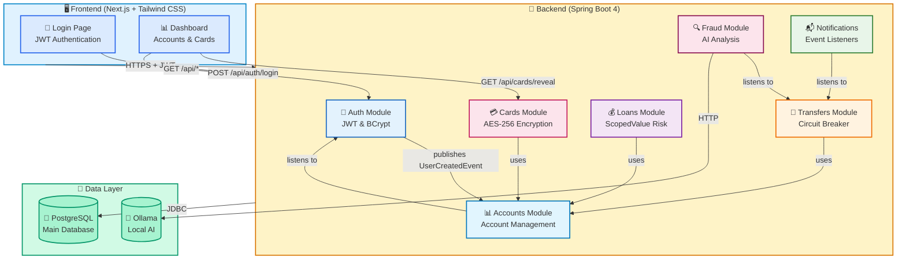

# NeoBank Core - Technical Architecture

This document contains the technical architecture, development roadmap, and implementation details for NeoBank Core.

---

## Table of Contents

- [Development Status](#development-status)
- [High-Level Architecture](#high-level-architecture)
- [Architecture Overview](#architecture-overview)
- [Tech Stack](#tech-stack)
- [Key Features](#key-features)
- [Resilience Features](#resilience-features)
- [Hybrid AI Strategy](#hybrid-ai-strategy)
- [Project Structure](#project-structure)
- [Module Boundaries](#module-boundaries)
- [Roadmap](#roadmap)

---

## Development Status

| Phase | Module | Status | Description |
|-------|--------|--------|-------------|
| **Phase 1** | Loans & Cards | ✅ Complete | Loan origination with ScopedValue, card management with AES-256 encryption |
| **Phase 2** | Security & Auth | ✅ Complete | JWT authentication, BCrypt passwords, role-based access control |
| **Phase 3** | Frontend Dashboard | ✅ Complete | Next.js + Tailwind CSS with secure card reveal functionality |
| **Phase 4** | Advanced Features | 📋 Planned | Multi-currency, scheduled transfers, budgeting tools |
| **Phase 5** | Infrastructure | 📋 Planned | Kubernetes, event sourcing, GraphQL API |

---

## High-Level Architecture



### Architecture Overview

| Module | Responsibility | Key Features |
|--------|---------------|--------------|
| **Auth** | User authentication & authorization | JWT tokens, BCrypt passwords, UserCreatedEvent publishing |
| **Accounts** | Account creation, retrieval, and balance management | Pessimistic locking, JSONB transaction history, auto-creation on user registration |
| **Transfers** | Atomic fund transfers with circuit breaker protection | Resilience4j, event publishing, async processing |
| **Loans** | Loan origination and management | ScopedValue risk context, interest calculation, amortization schedules |
| **Cards** | Card lifecycle and spending management | AES-256-GCM encryption, status controls, MCC filtering, secure reveal endpoint |
| **Fraud** | AI-powered fraud analysis | Hybrid AI (OpenAI/Ollama), risk scoring, Micrometer tracking |
| **Notifications** | Asynchronous event listener | Transaction notifications, non-blocking |
| **Frontend** | Next.js dashboard | JWT authentication, account overview, card management with reveal |

All modules communicate through **Spring Modulith's** enforced boundaries, ensuring loose coupling and architectural integrity.

---

## Tech Stack

### Backend

| Technology | Version | Purpose |
|------------|---------|---------|
| Java | 25 | Virtual threads, records, pattern matching |
| Spring Boot | 4.0.0 | Application framework |
| Spring Modulith | 1.4.0 | Modular architecture enforcement |
| Spring AI | 2.0.0-M1 | Hybrid AI (OpenAI/Ollama) for fraud detection |
| Spring Security | 7.0.0 | JWT authentication & authorization |
| Resilience4j | 2.3.0 | Circuit breaker pattern for fault tolerance |
| Spring Data JPA | - | Database access layer |
| JJWT | 0.12.6 | JWT token generation and validation |
| PostgreSQL | 17 | Production database |
| Testcontainers | 2.0.3 | Integration testing with real PostgreSQL |
| Micrometer | - | Metrics and observability (Prometheus) |
| OpenAPI/Swagger | 2.8.9 | API documentation |
| Ollama | latest | Local AI model runner (llama3.2) |

### Frontend

| Technology | Version | Purpose |
|------------|---------|---------|
| Next.js | 14.2 | React framework with App Router |
| React | 18.3 | UI component library |
| TypeScript | 5.4 | Type safety |
| Tailwind CSS | 3.4 | Utility-first CSS framework |
| js-cookie | 3.0 | JWT cookie management |
| Axios | 1.6 | HTTP client |

---

## Key Features

### Java 25
- **Virtual Threads** (Project Loom) - High-throughput concurrency
- **Records** - Immutable data carriers with concise syntax
- **Pattern Matching** - Enhanced type checking and data extraction

### Spring Modulith
- Module isolation and dependency validation
- Automated architecture documentation generation
- Prevents architectural drift through verification tests
- **Persistent Event Registry** - Events stored until successfully processed

### Spring AI
- Hybrid AI support (OpenAI cloud / Ollama local)
- Automatic token usage tracking via Micrometer
- Configurable risk thresholds with priority alerts

### Resilience4j Circuit Breakers
- Automatic circuit breaking when failure rates exceed 50%
- Graceful degradation with fallback responses
- Self-healing after configurable recovery periods

### PostgreSQL with Testcontainers
- Real PostgreSQL instances in Docker for integration tests
- No local database setup required
- Consistent, reproducible test environments

---

## Resilience Features

### Event Registry (Spring Modulith)
Domain events persisted to `event_publication` table:

| Feature | Benefit |
|---------|---------|
| **Durability** | Events survive application restarts |
| **Reliability** | Failed listeners automatically retried |
| **Consistency** | Events published after transaction commit |

```properties
spring.modulith.events.republish-outstanding-events-on-restart=true
spring.modulith.events.replication.period=60
```

### Circuit Breaker (Resilience4j)

| Setting | Value | Description |
|---------|-------|-------------|
| `failure-rate-threshold` | 50% | Opens when 50% calls fail |
| `wait-duration-in-open-state` | 30s | Time before half-open |
| `minimum-number-of-calls` | 5 | Min calls before evaluation |
| `sliding-window-size` | 10 | Call window for calculation |

```properties
resilience4j.circuitbreaker.instances.transfer.failure-rate-threshold=50
resilience4j.circuitbreaker.instances.transfer.wait-duration-in-open-state=30s
resilience4j.circuitbreaker.instances.transfer.minimum-number-of-calls=5
```

### AI Fraud Detection

| Feature | Description |
|---------|-------------|
| **Async Processing** | Non-blocking analysis via `@Async` |
| **Risk Scoring** | 0-100 score per transaction |
| **Alert Threshold** | `[FRAUD ALERT]` logged for scores > 80 |
| **Observability** | Token usage tracked via `gen_ai.client.token.usage` |

---

## Hybrid AI Strategy (Local vs. Cloud)

NeoBank supports multiple AI providers through Spring AI's abstraction layer.

### Supported Providers

| Provider | Model | Use Case | Cost | Latency |
|----------|-------|----------|------|---------|
| **OpenAI** | gpt-4o-mini | Production, highest accuracy | Pay-per-token | ~500ms |
| **Ollama** | llama3.2 | Local development, offline | Free | ~100ms |

---

## Switching AI Providers: Complete Guide

### Quick Start

```bash
# Development (Local/Ollama) - Default
mvn spring-boot:run

# Production (Cloud/OpenAI)
export OPENAI_API_KEY=sk-...
mvn spring-boot:run -Dspring-boot.run.profiles=openai
```

### Method 1: Maven Command Line (Recommended for Development)

```bash
# Run with Ollama (Local AI)
mvn spring-boot:run -Dspring-boot.run.profiles=local

# Run with OpenAI (Cloud AI)
export OPENAI_API_KEY=your-api-key-here
mvn spring-boot:run -Dspring-boot.run.profiles=openai
```

### Method 2: Java JAR Command (Production Deployment)

```bash
# Run with Ollama (Local AI)
java -jar target/neobank-core-0.0.1-SNAPSHOT.jar \
    --spring.profiles.active=local

# Run with OpenAI (Cloud AI)
java -jar target/neobank-core-0.0.1-SNAPSHOT.jar \
    --spring.profiles.active=openai \
    --spring.ai.openai.api-key=your-api-key-here
```

### Method 3: Environment Variable

```bash
# Set profile via environment
export SPRING_PROFILES_ACTIVE=local
mvn spring-boot:run

# Or for OpenAI
export SPRING_PROFILES_ACTIVE=openai
export OPENAI_API_KEY=your-api-key-here
mvn spring-boot:run
```

### Method 4: Permanent Configuration Change

Edit `src/main/resources/application.properties`:

```properties
# Change this line to switch default provider
spring.profiles.active=local    # or 'openai' for cloud-first
```

### Method 5: Docker Compose Profiles

```bash
# Local Development (includes Ollama container)
docker-compose --profile local up -d

# Production with OpenAI
export OPENAI_API_KEY=your-api-key-here
docker-compose --profile openai up -d
```

**What each profile starts:**

| Profile | Containers | Ports | Best For |
|---------|-----------|-------|----------|
| `local` | PostgreSQL, Ollama, NeoBank | 5432, 11434, 8080 | Development, testing |
| `openai` | PostgreSQL, NeoBank | 5432, 8081 | Production, CI/CD |

### Verification

```bash
# Check application info endpoint
curl http://localhost:8080/actuator/info | jq .

# Check logs for provider initialization
docker logs neobank-core | grep -i "ollama\|openai"
```

**Expected log output for local profile:**
```
Using Ollama Chat API at http://localhost:11434
Model: llama3.2
```

**Expected log output for openai profile:**
```
Using OpenAI Chat API
Model: gpt-4o-mini
```

### Fraud Detection Test

```bash
# Create accounts
curl -X POST http://localhost:8080/api/accounts \
    -H "Content-Type: application/json" \
    -d '{"ownerName": "Alice", "balance": 1000}'

curl -X POST http://localhost:8080/api/accounts \
    -H "Content-Type: application/json" \
    -d '{"ownerName": "Bob", "balance": 500}'

# Transfer and watch fraud analysis
curl -X POST http://localhost:8080/api/transfers \
    -H "Content-Type: application/json" \
    -d '{"fromId": "<alice-id>", "toId": "<bob-id>", "amount": 100}'

# Check fraud logs
docker logs neobank-core | grep -i "fraud\|risk"
```

### Troubleshooting

**Ollama not responding:**
```bash
# Pull model manually
docker exec -it neobank-ollama ollama pull llama3.2

# Verify Ollama is running
curl http://localhost:11434/api/tags
```

**OpenAI API errors:**
```bash
# Verify API key is set
echo $OPENAI_API_KEY

# Test OpenAI connectivity
curl https://api.openai.com/v1/models \
    -H "Authorization: Bearer $OPENAI_API_KEY"
```

### Cost Considerations

| Aspect | Local (Ollama) | Cloud (OpenAI) |
|--------|----------------|----------------|
| **Setup Cost** | None (uses local GPU/CPU) | API key required |
| **Per-Request Cost** | $0 | ~$0.0001-0.001 per transfer |
| **Hardware** | 8GB RAM minimum | None |
| **Accuracy** | Good for standard patterns | Higher for edge cases |
| **Privacy** | All data stays local | Data sent to OpenAI |

> **Recommendation:** Use **local** for development and testing. Switch to **openai** for production where higher accuracy justifies the cost.

---

## Project Structure

```
com.neobank
├── NeoBankCoreApplication.java
├── accounts/
│   ├── Account.java (Record)
│   ├── AccountEntity.java
│   ├── AccountRepository.java
│   ├── AccountService.java
│   └── api/AccountApi.java
├── transfers/
│   ├── TransferRequest.java (Record)
│   ├── TransactionResult.java (Record)
│   ├── TransferCompletedEvent.java (Record)
│   ├── api/TransferApi.java
│   ├── internal/ (package-private implementation)
│   └── web/TransferController.java
├── notifications/
│   └── NotificationService.java
└── fraud/
    ├── FraudListener.java
    └── FraudAnalysisConfig.java
```

---

## Module Boundaries

Spring Modulith enforces that modules only communicate through their public APIs:

| Module | Responsibility |
|--------|---------------|
| **accounts** | Account creation, retrieval, and management |
| **transfers** | Fund transfers with atomic transactions and event publishing |
| **notifications** | Asynchronous event listeners for side effects |
| **fraud** | AI-powered fraud analysis (listens to transfers) |

---

## Observability

### Metrics

Micrometer with Prometheus registry tracks:

| Metric | Description |
|--------|-------------|
| Transfer rate | Transfers per second |
| Circuit breaker state | State transitions |
| Event publication | Success/failure rates |
| AI token usage | `gen_ai.client.token.usage` |

Access metrics at: `http://localhost:8080/actuator/prometheus`

### Tracing

- Micrometer tracing enabled for all AI operations
- Token counts tracked per transaction
- Configurable observation include/exclude settings

---

## Roadmap

We have exciting plans for NeoBank Core! Here's what's coming:

### Phase 1: Core Banking Features

- [x] **Loans Module**: Implementing interest calculation with Scoped Value API (Java 25)
  - Loan origination workflow
  - Amortization schedules
  - Early repayment handling
  - Risk-based interest rates

### Phase 1.5: Card Services

- [x] **Card Module**: Lifecycle and spending management
  - Virtual & physical card issuance (linked to Accounts)
  - Status management (Active, Frozen, Blocked, Reported Stolen)
  - Spending controls (per-transaction and monthly limits)
  - MCC (Merchant Category Code) filtering (block gambling, international, etc.)
  - Card PIN management and secure storage
  - Contactless payment limits

### Phase 2: Security & Authentication

- [x] **Auth Module**: JWT-based security using Spring Security 7
  - User registration and login
  - Role-based access control (RBAC)
  - OAuth2 provider integration
  - Session management with Redis

### Phase 3: User Experience

- [x] **Frontend**: A lightweight React/Next.js dashboard
  - Account overview and analytics
  - Transfer history with filters
  - Real-time notifications
  - Fraud alert dashboard

### Phase 4: Advanced Features

- [ ] **Multi-currency Support**: FX conversion and international transfers
- [ ] **Scheduled Transfers**: Recurring payments and standing orders
- [ ] **Budgeting Tools**: Spending categorization and limits
- [ ] **Open Banking**: PSD2-compliant API for third-party integrations

### Phase 5: Infrastructure

- [ ] **Kubernetes Deployment**: Helm charts for cloud-native deployment
- [ ] **Event Sourcing**: Full audit trail with event replay capability
- [ ] **GraphQL API**: Alternative query layer for flexible data fetching
- [ ] **gRPC Services**: High-performance inter-service communication

---

Have ideas or want to contribute to these features? Check out [CONTRIBUTING.md](../CONTRIBUTING.md) and join us!
